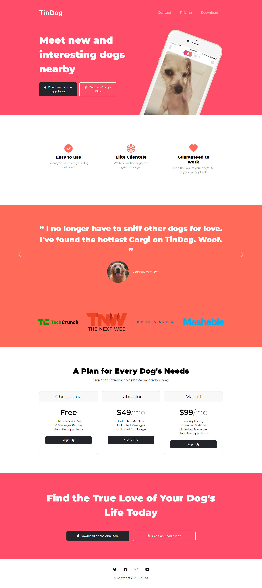

<a href="https://ig0r-ferreira.github.io/tindog/" target="_blank"><h1 style="text-align: center;">TinDog</h1></a>

[Tindog](https://ig0r-ferreira.github.io/tindog/) is a one-page site, based on Tinder, but aimed at the canine audience. It's just a front-end and was developed while learning web development at 100 Days of Code (Python Bootcamp) with instructor Angela Yu.

## Screenshots

## Tools Used

&nbsp;

&nbsp;

## Author

-   [Igor Ferreira](https://github.com/ig0r-ferreira)

## License

This project is under the [MIT license](LICENSE).
